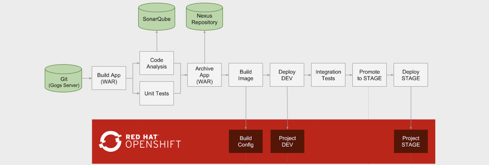

*For other versions of OpenShift, follow the instructions in the corresponding branch.

# CI/CD Demo - OpenShift Container Platform 4.3

This repository includes the infrastructure and pipeline definition for continuous delivery using Jenkins, Nexus, SonarQube and CodeReady Workspaces/Eclipse Che (Optional) on OpenShift. 

* [Introduction](#introduction)
* [Prerequisites](#prerequisites)
* [Automated Deploy on OpenShift](#automated-deploy-on-openshift)
* [Troubleshooting](#troubleshooting)
* [Demo Guide](#demo-guide)
* [Using Eclipse Che for Editing Code](#using-eclipse-che-for-editing-code)


## Introduction

On every pipeline execution, the code goes through the following steps:

1. Code is cloned from Gogs, built, tested and analyzed for bugs and bad patterns
2. The WAR artifact is pushed to Nexus Repository manager
3. A container image (_tasks:latest_) is built based on the _Tasks_ application WAR artifact deployed on WildFly
4. The _Tasks_ container image is deployed in a fresh new container in DEV project 
5. If tests successful, the pipeline is paused for the release manager to approve the release to STAGE
6. If approved, the DEV image is tagged in the STAGE project. 
6. The staged image is deployed in a fresh new container in the STAGE project

The following diagram shows the steps included in the deployment pipeline:



The application used in this pipeline is a JAX-RS application which is available on GitHub and is imported into Gogs during the setup process:
[https://github.com/OpenShiftDemos/openshift-tasks](https://github.com/OpenShiftDemos/openshift-tasks/tree/eap-7)

## Prerequisites
* 10+ GB memory


# Get OpenShift 4

[Download and install CodeReady Containers](https://developers.redhat.com/products/codeready-containers/overview) in order to create a local OpenShift 4 cluster on your workstation. Otherwise [create an OpenShift 4 cluster](https://try.openshift.com) on the public cloud or the infrastructure of your choice.

## Automated Deploy on OpenShift

Please run the following command first to install all the templates locally.

```
./scripts/install-local-templates.sh deploy
```

You can use the `scripts/provision.sh` script provided to deploy the entire demo 

  ```
  ./scripts/provision.sh --help
  ./scripts/provision.sh deploy --private
  ```

To run this in a fully public environment, you can remove the --private option


To delete everything
  ```
  ./scripts/provision.sh delete 
  ./scripts/install-local-templates.sh delete
  ```  


## Troubleshooting

* If Maven fails with `/opt/rh/rh-maven33/root/usr/bin/mvn: line 9:   298 Killed` (e.g. during static analysis), you are running out of memory and need more memory for OpenShift.

* If running into `Permission denied` issues on minishift or CDK, run the following to adjust minishift persistent volume permissions:
  ```
  minishift ssh
  chmod 777 -R /var/lib/minishift/
  ```

## Demo Guide

* Take note of these credentials and then follow the demo guide below:

  * Gogs: `gogs/gogs`
  * Nexus: `admin/admin123`
  * SonarQube: `admin/admin`

* A Jenkins pipeline is pre-configured which clones Tasks application source code from Gogs (running on OpenShift), builds, deploys and promotes the result through the deployment pipeline. In the CI/CD project, click on _Builds_ and then _Pipelines_ to see the list of defined pipelines.

    Click on _tasks-pipeline_ and _Configuration_ and explore the pipeline definition.

    You can also explore the pipeline job in Jenkins by clicking on the Jenkins route url, logging in with the OpenShift credentials and clicking on _tasks-pipeline_ and _Configure_.

* Run an instance of the pipeline by starting the _tasks-pipeline_ in OpenShift or Jenkins.

* During pipeline execution, verify a new Jenkins slave pod is created within _CI/CD_ project to execute the pipeline.


* Pipelines pauses at _Deploy STAGE_ for approval in order to promote the build to the STAGE environment. Click on this step on the pipeline and then _Promote_.

* After pipeline completion, demonstrate the following:
  * Explore the _snapshots_ repository in Nexus and verify _openshift-tasks_ is pushed to the repository
  * Explore SonarQube and show the metrics, stats, code coverage, etc
  * Explore _Tasks - Dev_ project in OpenShift console and verify the application is deployed in the DEV environment
  * Explore _Tasks - Stage_ project in OpenShift console and verify the application is deployed in the STAGE environment  


* Clone and checkout the _eap-7_ branch of the _openshift-tasks_ git repository and using an IDE (e.g. JBoss Developer Studio), remove the ```@Ignore``` annotation from ```src/test/java/org/jboss/as/quickstarts/tasksrs/service/UserResourceTest.java``` test methods to enable the unit tests. Commit and push to the git repo.

* Check out Jenkins, a pipeline instance is created and is being executed. The pipeline will fail during unit tests due to the enabled unit test.

* Check out the failed unit and test ```src/test/java/org/jboss/as/quickstarts/tasksrs/service/UserResourceTest.java``` and run it in the IDE.

* Fix the test by modifying ```src/main/java/org/jboss/as/quickstarts/tasksrs/service/UserResource.java``` and uncommenting the sort function in _getUsers_ method.

* Run the unit test in the IDE. The unit test runs green. 

* Commit and push the fix to the git repository and verify a pipeline instance is created in Jenkins and executes successfully.


## Using Eclipse Che for Editing Code

You can install CodeReady Workspaces on OpenShift 4 using the OperatorHub. Follow the [Installing Che on OpenShift 4 from OperatorHub](https://www.eclipse.org/che/docs/che-7/installing-che-on-openshift-4-from-operatorhub/) docs in order to install Eclipse Che 7. Alternatively, if you OpenShift cluster is accessible over the internet, you can use the hosted Eclipse Che service at https://che.openshift.io .


You can then follow these [instructions](docs/using-eclipse-che.md) to use Eclipse Che for editing code in the above demo flow.  
